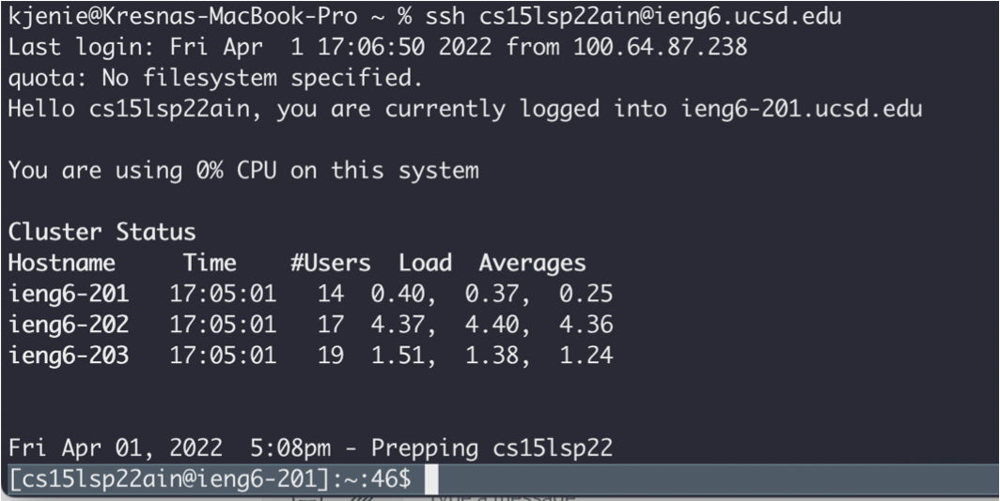

# Week 2 Lab Report
### 1. Installing VSCode

This is my visual studio code after I installed it.  
VSCode is used as a text editor for programming.

### 2. Remotely Connecting

This is me connecting remotely to the `ieng6.ucsd.edu` server.  
The command:
```
$ ssh cs15lsp22ain@ieng6.ucsd.edu
```
My user is `cs15lsp22ain` and the server name is `ieng6.ucsd.edu`. And I use `ssh` to connectly remote to the server.

### 3. Trying Some Commands

In this screenshot I tried out a few commands in the server.
1. `touch` to create a new file
2. `nano` to edit the file and save it
3. `cat` to print the contents of the file
4. `ls` to list what is in the direcotry

### 4. Moving Files

I used `scp` to move files from my local computer to the remote server. This is the command that I used:
```
$ scp WhereAmI.java cs15lsp22ain@ieng6.ucsd.edu:~/
```
- `scp` is the command to move files (secure copy)
- `WhereAmI.java` is the file I want to copy in my local directory
- `cs15lsp22ain@ieng6.ucsd.edu:~/` is the server that I want to copy to. And the `:~/` command is to make sure that the file gets copied to the home directory. 

After the file is successfully copied, I ran this command again:
```
$ ssh cs15lsp22ain@ieng6.ucsd.edu
```
to connect to the server again.  
Lastly, I executed the file using:
```
$ javac WhereAmI.java
$ java WhereAmI
Linux
cs15lsp22ain
/home/linux/ieng6/cs15lsp22/cs15lsp22ain
/home/linux/ieng6/cs15lsp22/cs15lsp22ain
```

### 5. Setting an SSH Key

It can be seen in this screenshot that I could remotely connect to the server without having to input my password. This could happen because I made an `ssh-keygen` which is stored in my local file and also the remote server. Since they have the same keygen I can remotely connect without inputting a password.

### 6. Optimizing Remote Running

I optimized remote running in this screenshot by combining three commands into one.
```
$ cp WhereAmI.java OtherMain.java; javac OtherMain.java; java WhereAmI
Linux
cs15lsp22ain
/home/linux/ieng6/cs15lsp22/cs15lsp22ain
/home/linux/ieng6/cs15lsp22/cs15lsp22ain
```
- `cp WhereAmI.java OtherMain.java` copies `WhereAmI.java` to `OtherMain.java`
- `javac OtherMain.java` compiles `OtherMain.java`
- `java WhereAmI` runs the file