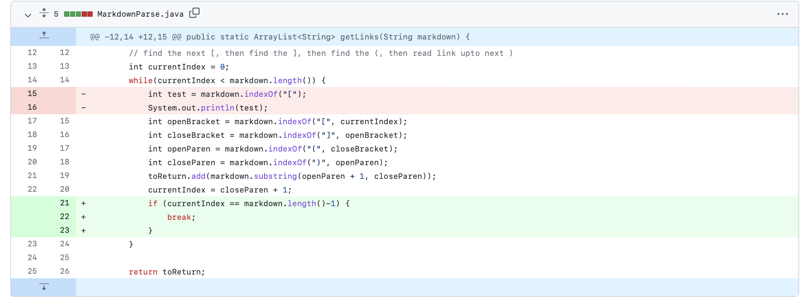
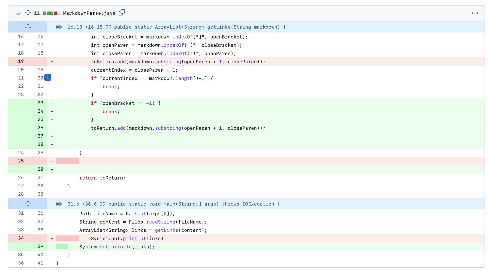
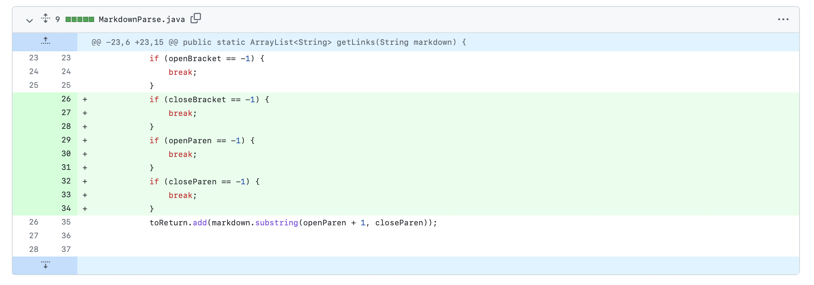

# Week 4 Lab Report

### First Code Change

Error file: [error-file.md](https://github.com/kresnajenie/markdown-parser/blob/main/error-file.md)

Symptom: It created an infinite loop

Relationship: Since there were no stop to the file when there was a new line, there was a bug. It created an infinite loop. This prompted the file to run forever which did not output anything.

### Second Code Change

Error file: [error-use-paren.md.md](https://github.com/kresnajenie/markdown-parser/blob/main/error-use-paren.md)

Symptom: It still outputed links even though there should not be any links

Relationship: Since the links were not formatted correctly (there were no []), it still caught the links. This created the wrong output.

### Third Code Change

Error file: [error-no-paren.md](https://github.com/kresnajenie/markdown-parser/blob/main/error-no-paren.md)

Symptom: The program will crash 

Relationship: Since there are square brackets, the program tries to find a link even though there is not one. Due to that fact, it will make the program crash.