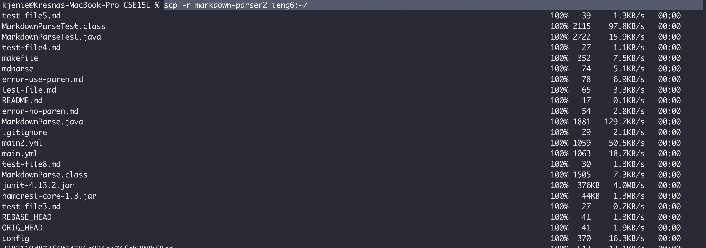
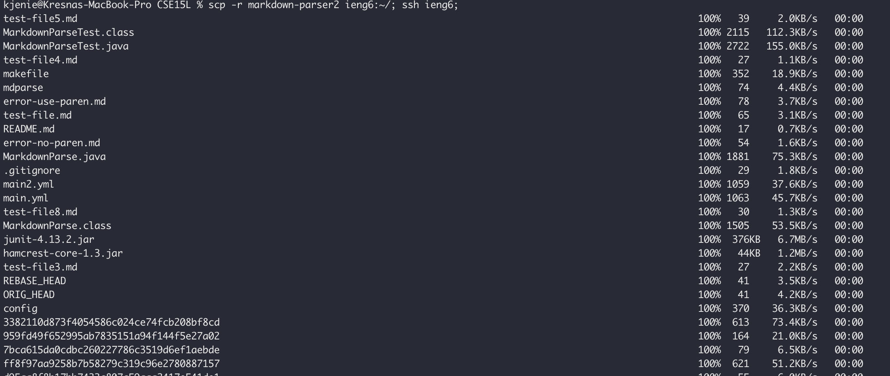

# Lab Report 3

### Streamline ssh

I edited the `.ssh/config` file on the terminal by typing `nano ~/.ssh/config` and input the following code:
```bash
Host ieng6
    HostName ieng6.ucsd.edu
    User cs15lsp22ain
```

Then I saved and closed the file by using the following commands:
1. `Ctrl + o` 
2. `Enter`
3. `Ctrl + x`

#### SSH
I typed `ssh ieng6` to ssh to the server


#### SCP
I made a `hello.txt` file to scp in the server with the command 
```bash
$ scp hello.txt ieng6:~/
```


### Setup Github Access from ieng6

I typed this command to make the key:
```bash
$ ssh-keygen -t rsa -b 4096 -C "kresna.jenie@gmail.com"
```


Then I used the `cat` command to copy the key which is stored at `/home/linux/ieng6/cs15lsp22/cs15lsp22ain/.ssh/id_rsa.pub`:


Then I added the key to github called `ieng6`:


Added this code to `~/.ssh/config`:
``` bash
Host github.com
    HostName github.com
    User kresnajenie
    IdentityFile ~/.ssh/id_rsa.pub
```

### Copy whole directories with scp -r

I used this command to copy the `markdown-parser2` directory
```bash
scp -r markdown-parser2 ieng6:~/
```


Then I `ssh` to the `ieng6` and run the tests:


The I combined `scp` and `ssh`:


