# Lab Report 4

Repositories:  
- [Repository Reviewed](https://github.com/mdsflyboy/markdown-parser.git)
- [My Repository](https://github.com/kresnajenie/markdown-parser2)

## Snippet 1
### Preview
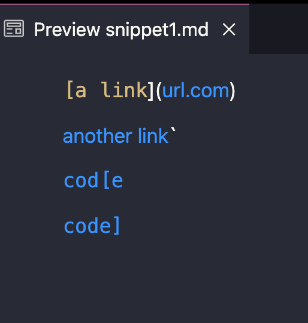

### My Implementation
Test
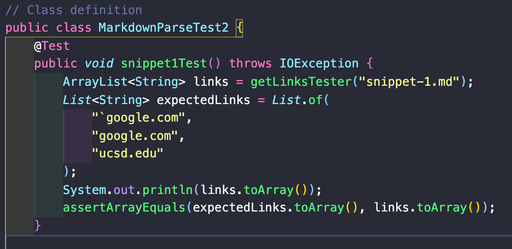
Output
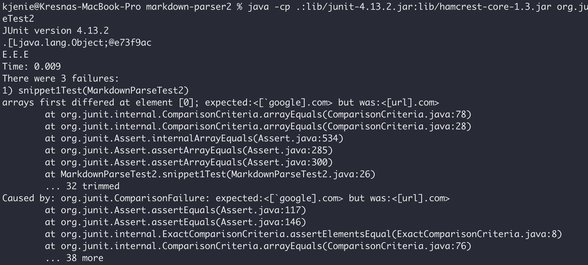

### Reviewed Implementation
Test
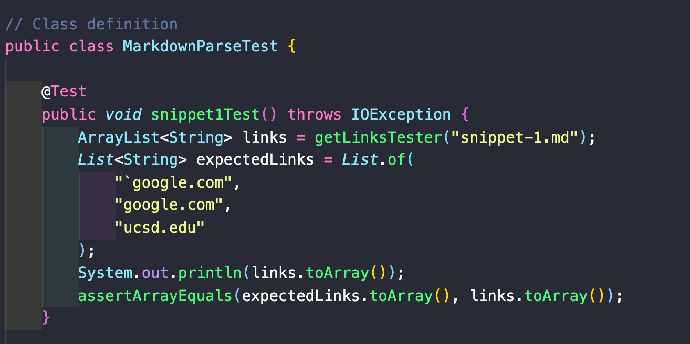
Output
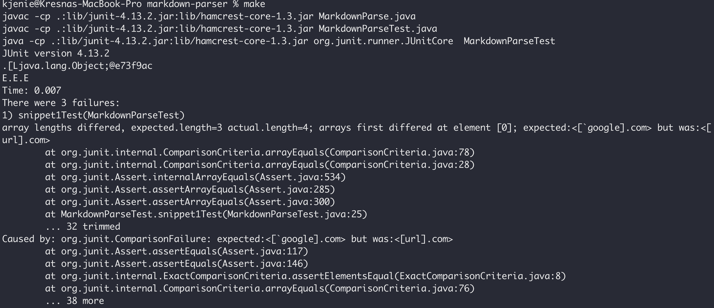

## Snippet 2
### Preview
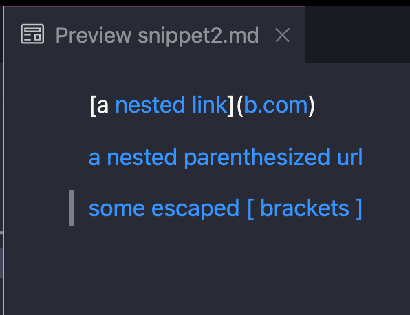

### My Implementation
Test
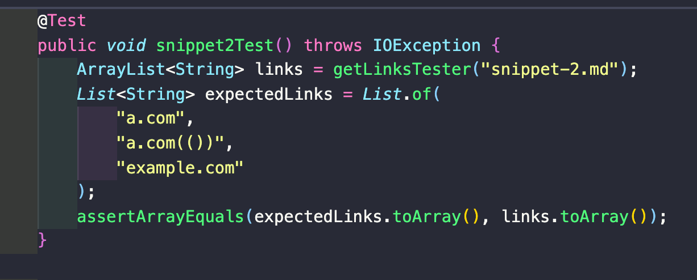
Output
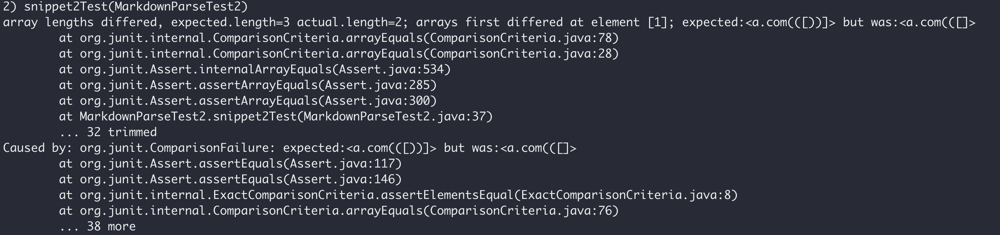

### Reviewed Implementation
Test
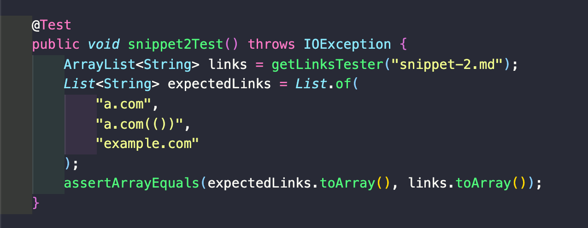
Output
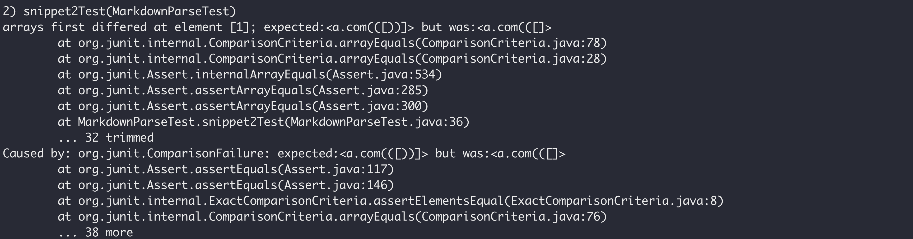

## Snippet 3
### Preview
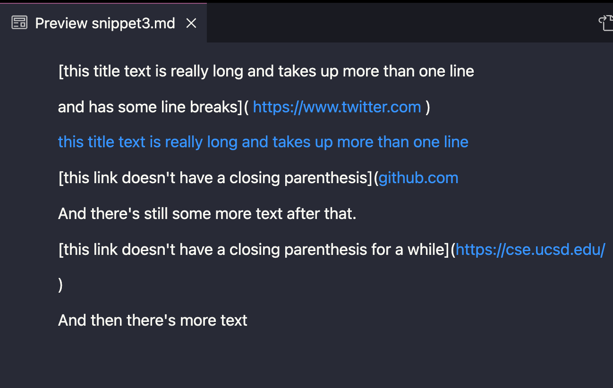
### My Implementation
Test
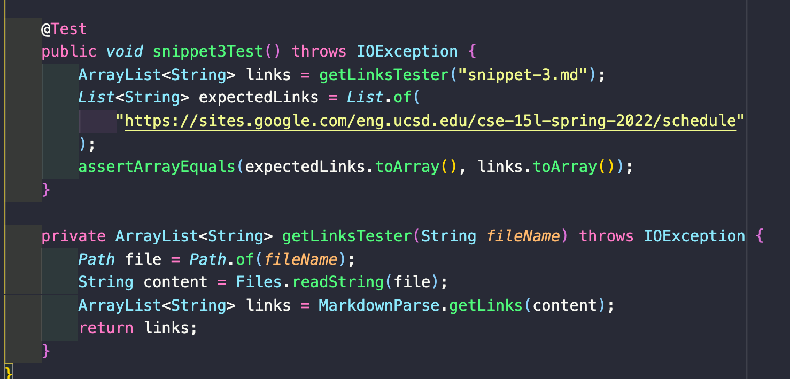
Output
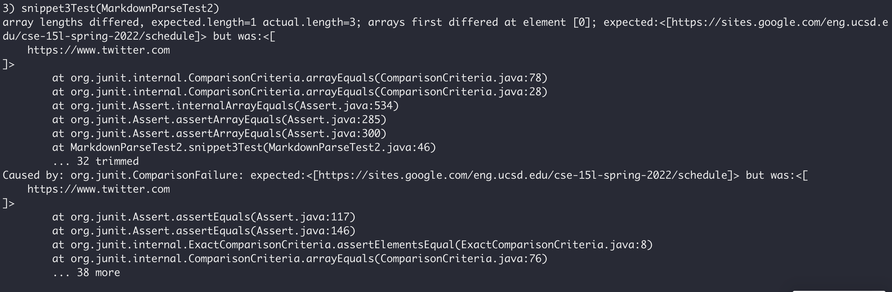

### Reviewed Implementation
Test
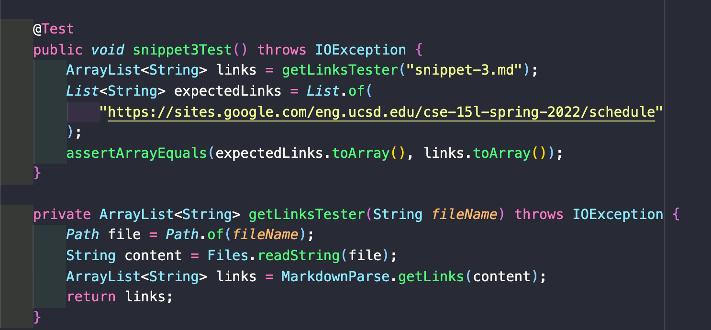
Output
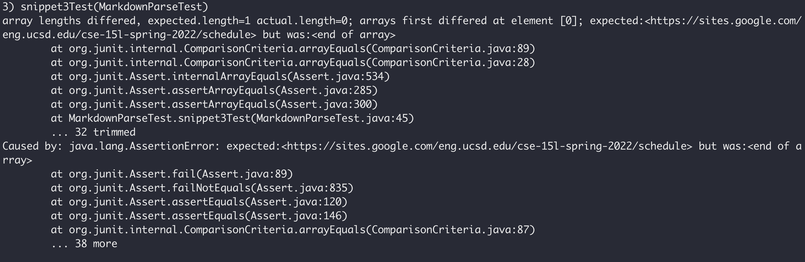

## Questions
1. **Do you think there is a small (<10 lines) code change that will make your program work for snippet 1 and all related cases that use inline code with backticks? If yes, describe the code change. If not, describe why it would be a more involved change.**
I think a small code change would be possible to resolve the issue for snippet1. A couple of if statements can be put to see if there are multiple brackets and also if there are back ticks in the code. Since there would only be a couple of if statments, I think the code can be shorter than 10 lines.

2. **Do you think there is a small (<10 lines) code change that will make your program work for snippet 2 and all related cases that nest parentheses, brackets, and escaped brackets? If yes, describe the code change. If not, describe why it would be a more involved change.** 
I think there needs to be a more involved change in the code to fix snippet2. Since for each nested parentheses, brackets, and escaped brackets, we have to find which one is the outmost element. In my opinion, finding the outmost element of each paranthese, brackets, and escaped brackets will take more than 10 lines.

3. **Do you think there is a small (<10 lines) code change that will make your program work for snippet 3 and all related cases that have newlines in brackets and parentheses? If yes, describe the code change. If not, describe why it would be a more involved change.**  
I think a small code change would be possible to resolve the issue for snippet3. There can be an if statement that checks if there are line breaks in the brackets to see if it is an actual link or not. Hence, I think it would take a minimal change of code to resolve the issue.

