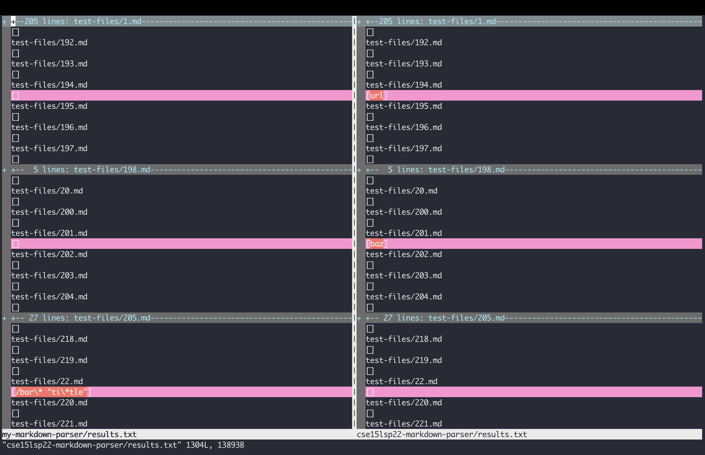
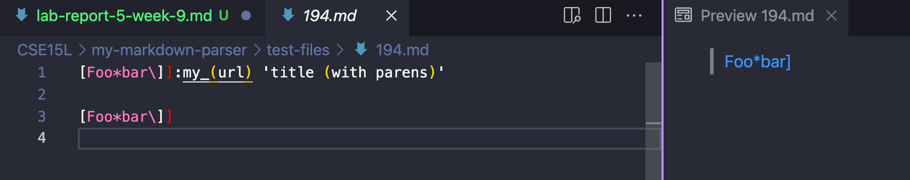
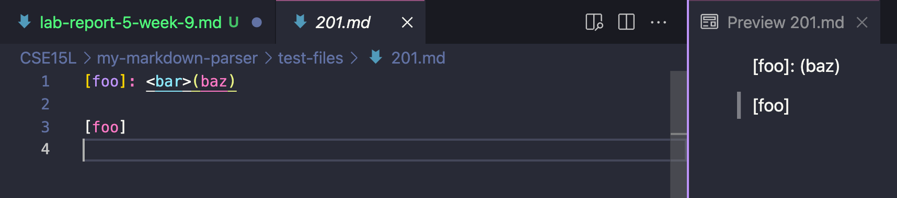

# Lab Report 5

 **How you found the tests with different results (Did you use vimdiff on the results of running a bash for loop? Did you search through manually? Did you use some other programmatic idea?)**

 I used `vimdiff` to see the different results. I put this code in the terminal:
 ```bash
 $ vimdiff my-markdown-parser/results.txt cse15lsp22-markdown-parser/results.txt
 ```
Which outputed this result:  


From this result I can see that `test-files/194.md` and `test-files/201.md` have different results.

**Different Test Files**  
1. [194.md](https://github.com/nidhidhamnani/markdown-parser/blob/main/test-files/194.md)
1. [201.md](https://github.com/nidhidhamnani/markdown-parser/blob/main/test-files/201.md)

### Tests
1. **194**  
**Output**:  

**Preview**:  


Both of the implementation are incorrect. According to the preview, the link should be `title with parens`

I think the solution for both implementation could be checking for multiple brackets. A couple of if statements could be implemented to check wether there are multiple brackets or not.

1. **201**

**Preview**:  


For this one, the correct implementation is from `my-markdown-parser` since according to the preview, there should be no link.

I think the solution for the implementation that was provided is to check if there are characters between the end brackets and the start parantheses. It should not have any characters between the end bracket and the start parantheses.